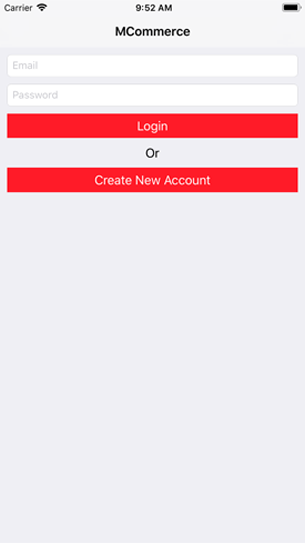
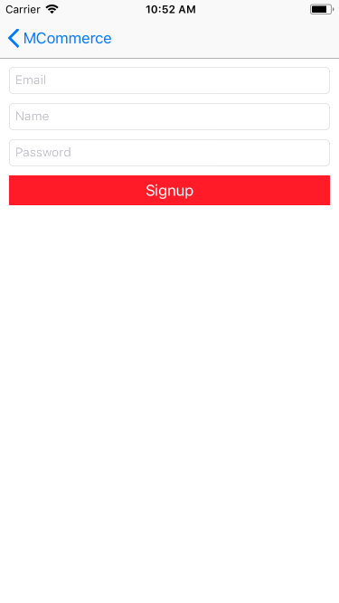
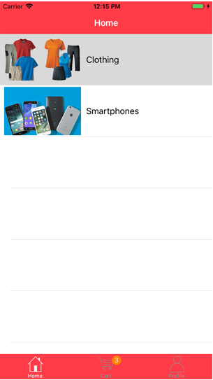
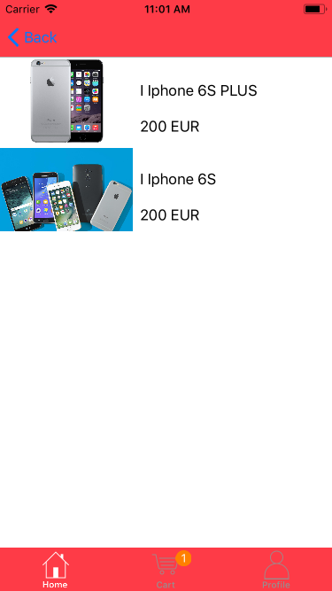
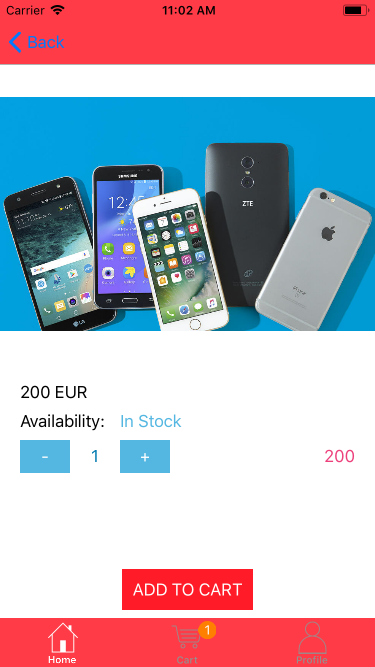
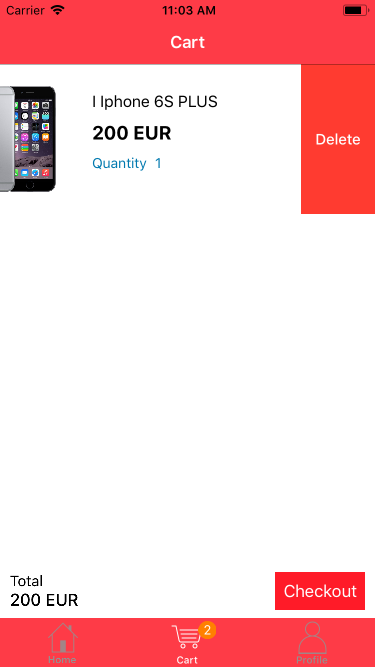
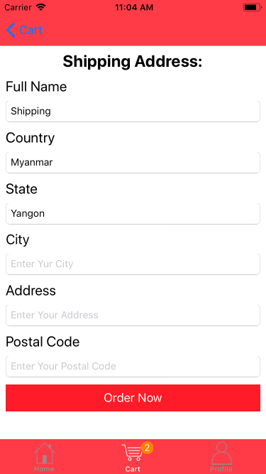
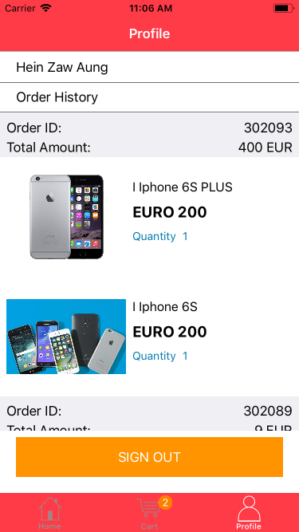

# MCommerce Application

## Overview

Simple Mobile Commerce Application. User can browse products and make order.

## Backend Api 
http://marketcloud.it/

## Implemented features ##

1. Login and Sign in
2. List of available categories and products 
3. Add and remove a product from your cart
4. See details about a product
5. Add a shipping address
6. Make order

## Sample screenshots ##

Login View 

Sign In

Category list

Products list

Products Detail

Remove from cart (swipe left on a product when in your cart)

Add a shipping address

Order History

